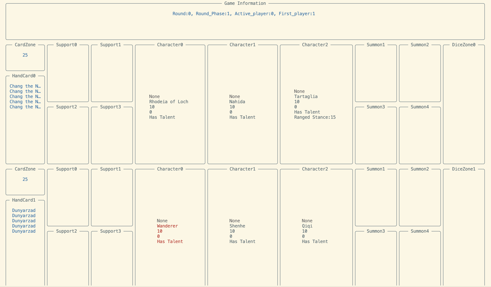

# Genius-Invokation
A simulator of the Genius Invokation TCG in Genshin impact for Reinforcement Learning
一个用于强化学习的原神七圣召唤卡牌模拟器

[Document]() | [详细信息文档](https://j0mmhq251c1.feishu.cn/drive/folder/Xl6ZfevqplEfNud10YLcgP44nGh?from=from_copylink) | [Attach]()

我们的项目目标是基于python搭建原神七圣召唤卡牌游戏的模拟器对战环境，并在此基础上基于Reinforcement Learning训练七圣召唤的AI牌手。目前我们实现了原神七圣召唤游戏的主要功能。由于我们的贡献者都是出于热爱的工作，精力有限，目前只实现了部分卡片的实现，但需要的主要接口都已完成。如果您在体验过程中发现有任何bug或者实现了部分卡片的功能，请及时联系我们。

## Roadmap
- [x] 实现了游戏主体架构的搭建
- [x] 完成了伤害系统的实现
- [x] 完成了骰子计算系统的实现
- [x] 完成了本地终端的调试接口
- [ ] 全部卡片的书写
    - [ ] 角色卡片进度:16/57
    - [ ] 行动卡片进度:
        - [ ] 天赋进度:0/57
        - [ ] 装备牌进度:2/58
        - [x] 支援牌进度:38/38
        - [ ] 事件牌进度:27/59
- [ ] 完成了网页端的调试接口
    - [x] 实现了在网页端的输入调试
    - [ ] 实现了在网页端的交互式调试
- [ ] 完成了强化学习算法的实习和训练

## 本地运行
在本环节您将了解到如何在本地终端运行本代码。我们建议您使用conda来创建一个新的环境。

### `Install environment`

    pip install -r requirments.txt
    pip install -e .

### Fix deck

    在 genius_invocation/main.py 中修改 deck1 和 deck2 来确定两位 player 的出战牌组。 目前您可以任意组合您的手牌选择。您可以在 genius_invocation/card/character/characters 下找到您可以使用的角色牌。 genius_invocation/card/action 下的各个子目录找到您可以使用的行动牌。 

### Play game

    python main.py 来游玩我们的游戏。我们有三种形式的信息输出：

    1. logoru.logger: 用于进行关键步骤的输出
    2. print: 用于告知玩家Action
    3. rice.Layout: 展示对战信息

    您将可以形如下图的对战信息。

### Define game

    我们目前为您默认进行一些便于Debug的配置。如果您想体验完整的游戏环节，请修改一下配置：
        
        不跳过了重新投掷骰子和选择手牌的环节： genius_invocation/main.py Line 23， jump=False
        角色不默认装备天赋：genius_invocation/game/player.py Line37， talent=False
        每回合初始8个骰子非默认万能：genius_invocation/game/player.py Line102，is_omni=False