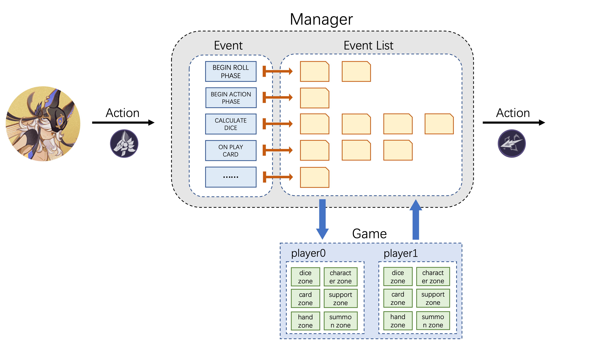
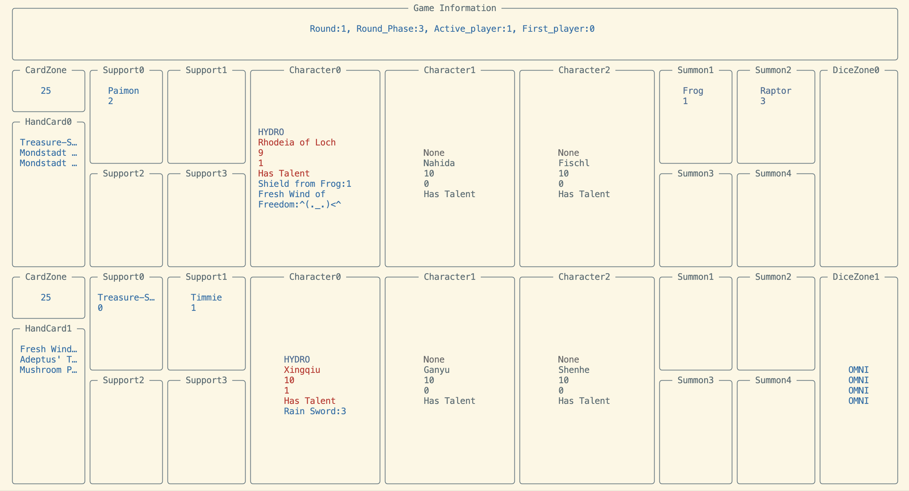
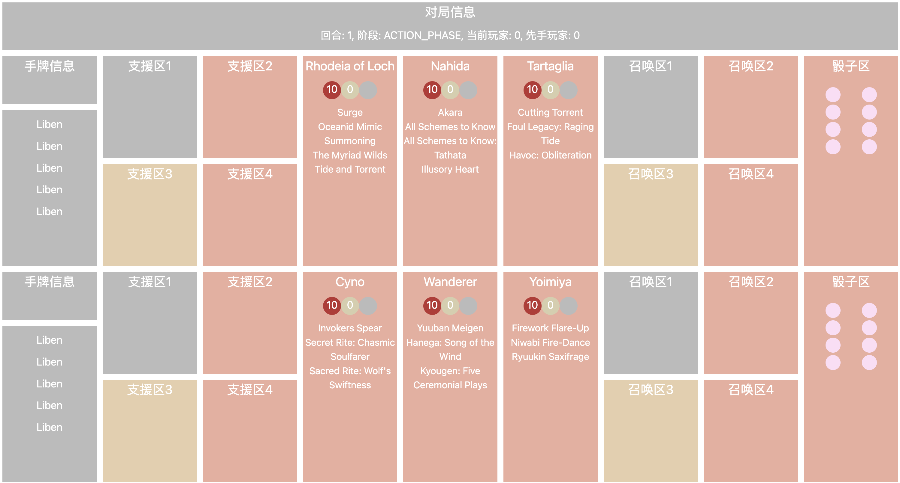

# Genius-Invokation
A simulator of the Genius Invokation TCG in Genshin impact
一个用于自定义卡牌、训练强化学习AI的原神七圣召唤卡牌模拟器

[网页demo](https://flick-ai.github.io/Genius-Invokation-Website/) ｜ [Document](https://genius-invokation.readthedocs.io/zh/latest/) | [详细信息文档](Explaination.md) | [测试表格](https://j0mmhq251c1.feishu.cn/sheets/RloasMqWHh1RgytsZfqcblqBnge?from=from_copylink) | [Attach](qq.jpg)



我们的项目目标是基于python搭建原神七圣召唤卡牌游戏的模拟器对战环境，使得使用者可以随心所欲的自定义卡牌并测试其强度，并在此基础上基于Reinforcement Learning训练七圣召唤的AI牌手。目前我们的环境已经可以支持游戏，并且基本实现了和七圣召唤中相同的结算效果。您可以阅读我们撰写的详细信息文档和该库的参考文档，来实现您自己的七圣召唤卡牌！

由于我们的贡献者都是出于热爱的工作，精力有限，目前只实现了部分卡片的实现，但需要的主要接口都已完成。如果您在体验过程中发现有任何bug或者实现了部分卡片的功能，请及时联系我们。如果您测试了一些卡片并发现其没有问题，欢迎填写我们的测试表格。

## Roadmap
- [x] 实现了游戏主体架构的搭建
- [x] 完成了伤害系统的实现
- [x] 完成了骰子计算系统的实现
- [x] 完成了本地终端的调试接口
- [ ] 全部卡片的书写
    - [ ] 角色卡片进度:16/57
    - [ ] 行动卡片进度:
        - [ ] 天赋进度:0/57
        - [ ] 装备牌进度:2/58
        - [x] 支援牌进度:38/38
        - [ ] 事件牌进度:27/59
- [ ] 完成了网页端的调试接口
    - [x] 实现了在网页端的输入调试
    - [x] 实现了在网页端的交互式调试
    - [ ] 丰富和美化网页端的功能
- [ ] 完成了强化学习算法的实习和训练


## 本地运行
在本环节您将了解到如何在本地终端运行本代码。我们建议您使用conda来创建一个新的环境。

### `Install environment`

    pip install -r requirments.txt
    pip install -e .


### Fix deck

    在 genius_invocation/main.py 中修改 deck1 和 deck2 来确定两位 player 的出战牌组。 
    目前您可以任意组合您的手牌选择。您可以在：

        genius_invocation/card/character/characters 下找到您可以使用的角色牌。 
        genius_invocation/card/action 下的各个子目录找到您可以使用的行动牌。 

### Play game

    python main.py 来游玩我们的游戏。我们有三种形式的信息输出：

    1. logoru.logger: 用于进行关键步骤的输出
    2. print: 用于告知玩家Action
    3. rice.Layout: 展示对战信息

    您将可以形如下图的对战信息。我们会告知您您当前可以执行的所有动作选择、动作目标和列表选择。您只需要按照中文描述输入数字即可。



### Define game

    我们目前为您默认进行一些便于Debug的配置。如果您想体验完整的游戏环节，请修改一下配置：
        
        不跳过了重新投掷骰子和选择手牌的环节： genius_invocation/main.py Line 23， jump=False
        角色不默认装备天赋：genius_invocation/game/player.py Line37， talent=False
        每回合初始8个骰子非默认万能：genius_invocation/game/player.py Line102，is_omni=False

## 网页端运行
    您可以通过我们的网页端demo(https://flick-ai.github.io/Genius-Invokation-Website/)进行运行，
    或者自己在本地配置网页端进行运行。网页端的交互更加便利，并且支持不同的设备。


### 网页端说明
我们并没有太多的Web应用开发经验，目前的这个版本仅为了优化游戏体验和方便不熟悉python运行环境的玩家体验我们的项目。如果您有相关的开发经验并且有兴趣和我们一起优化这个应用，欢迎联系并加入我们！

本项目使用了PyScript完成Python程序的浏览器运行，因此所有的游戏都是在浏览器端执行计算的，
### 网页端游玩教程
您可以使用电脑端（鼠标）或移动端（点击）来控制游戏。
目前部署的网页端demo为固定卡组，如果您在本地部署将能够自定义卡组。后续我们会支持网页端配置卡组。

### 网页端本地部署教程
在website文件夹中执行```bash rebuild.sh```并访问```localhost:5001```